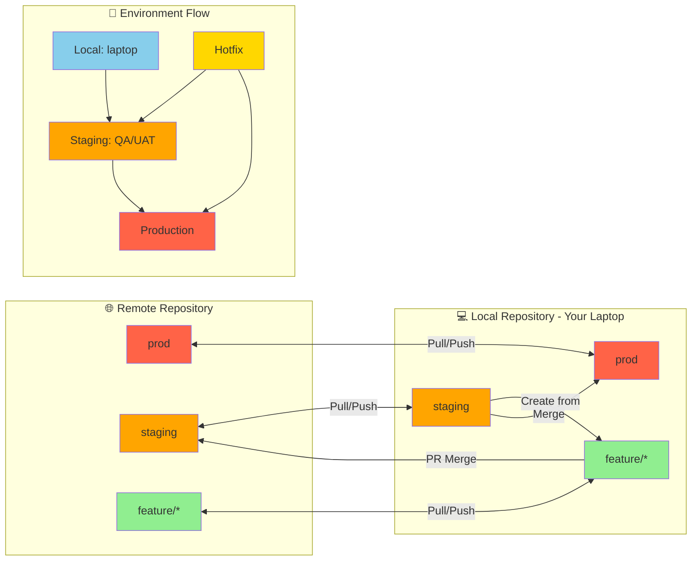
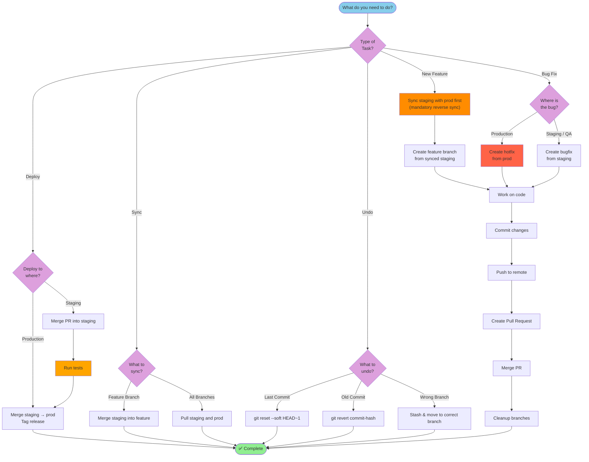
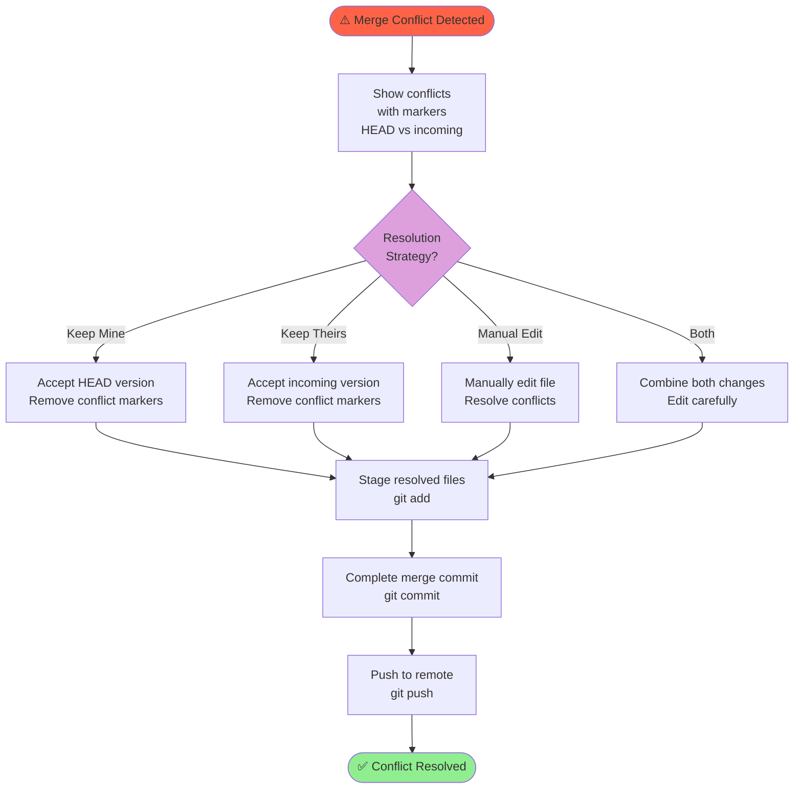

# Complete Git Workflow - Mermaid Flowchart

**Environments:** Local (laptop) -> Staging -> Prod
**Promotion flow:** `feature/* -> staging -> prod`

There is no `dev` branch. Your laptop IS the dev environment.
`staging` is the integration branch: all PRs land there.

## 📊 COMPREHENSIVE WORKFLOW FLOWCHART

```mermaid
flowchart TD
    Start([🚀 Start: Working Code Folder]) --> Init{New or<br/>Existing<br/>Project?}

    %% New Project Setup
    Init -->|New| New1["📝 Initialize Git<br/>Create .gitignore<br/>Initial commit"]
    New1 --> New2["📝 Create GitHub Repo<br/>Link remote origin"]
    New2 --> New3["📝 Setup Branches<br/>prod, staging<br/>Push both branches"]
    New3 --> StagingReady

    %% Existing Project
    Init -->|Existing| Exist1["📝 Clone Repository<br/>Switch to staging branch"]
    Exist1 --> StagingReady

    %% Development Ready
    StagingReady([🎯 On Staging Branch<br/>Ready to Work]) --> Feature{Start New<br/>Feature?}

    %% Reverse Sync before Feature Development
    Feature -->|Yes| SyncStaging["📝 (Mandatory) Reverse Sync<br/>Check if staging is behind prod<br/>If behind: merge prod into staging<br/>Resolve conflicts, push staging"]
    SyncStaging --> Feat1["📝 Create Feature Branch<br/>feature/descriptive-name<br/>from synced staging"]
    Feat1 --> Feat2["💻 Implement Feature<br/>Write code & tests<br/>(runs on your laptop)"]
    Feat2 --> Feat3{More<br/>coding?}
    Feat3 -->|Yes| Feat2
    Feat3 -->|No| Feat4["📝 Review Changes<br/>git status & diff"]
    Feat4 --> Feat5["📝 Commit Changes<br/>Conventional commit message<br/>feat: description"]
    Feat5 --> Feat6{More<br/>commits?}
    Feat6 -->|Yes| Feat2
    Feat6 -->|No| PrePush["📝 (Mandatory) Sync with staging before push<br/>Merge staging into feature<br/>Resolve conflicts"]
    PrePush --> Feat7["📝 Push Feature Branch<br/>with upstream tracking"]
    Feat7 --> Feat7b["📝 Generate PR Title<br/>and Description"]
    Feat7b --> Feat8["⚠️ Create Pull Request<br/>base: staging ← compare: feature<br/>Use generated description"]
    Feat8 --> Review{PR<br/>Review<br/>Status?}

    %% PR Review Flow
    Review -->|Changes Requested| Rev1["📝 Address Review<br/>Make changes<br/>Commit & push"]
    Rev1 --> Review
    Review -->|Needs Update| UpdateBranch["📝 Update Branch<br/>Merge staging into feature<br/>Push"]
    UpdateBranch --> Review
    Review -->|Closed/Rejected| Cleanup["📝 Cleanup<br/>Delete feature branch<br/>local & remote"]
    Cleanup --> MoreFeatures
    Review -->|Approved & Merged| Merge1["📝 Switch to staging<br/>Pull latest<br/>Delete feature branch"]
    Merge1 --> Deployed["✅ Staging Updated<br/>Merging the PR IS<br/>the staging deploy"]
    Deployed --> Testing["⚠️ TESTING PHASE<br/>QA & UAT Testing<br/>on staging"]

    Testing --> TestResult{Tests<br/>Passed?}

    %% Testing Results - Staging bugs branch from staging, NOT hotfix
    TestResult -->|No - Bugs| StagingBugfix
    TestResult -->|Yes| MoreFeatures{More<br/>features<br/>before release?}

    MoreFeatures -->|Yes| SyncStaging
    MoreFeatures -->|No| DeployProd

    %% Staging Bugfix Flow (bugs found in staging, not yet in prod)
    StagingBugfix["🔧 Staging Bug Found"] --> BugFix1["📝 Create Bugfix Branch<br/>bugfix/bug-description<br/>from staging"]
    BugFix1 --> BugFix2["💻 Implement Fix<br/>Write fix & tests"]
    BugFix2 --> BugFix3["📝 Commit & Push<br/>PR to staging"]
    BugFix3 --> BugFix4["📝 After PR merged<br/>Pull latest staging"]
    BugFix4 --> Testing

    %% Production Deployment
    DeployProd["📝 Deploy to Production<br/>Pull latest prod<br/>Merge staging → prod<br/>Push prod"]
    DeployProd --> TagRelease["📝 Tag Release<br/>Version: vX.Y.Z<br/>Push tag"]
    TagRelease --> NextAction{Next<br/>Action?}

    %% Next Actions
    NextAction -->|New Feature| Feature
    NextAction -->|Production Bug| HotfixStart
    NextAction -->|Done| End([✅ Workflow Complete])

    %% Hotfix Flow (ONLY for production bugs - bugs affecting live users)
    HotfixStart([🚨 Production Bug]) --> Hot1["📝 Create Hotfix Branch<br/>hotfix/bug-description<br/>from prod"]
    Hot1 --> Hot2["💻 Implement Fix<br/>Write fix & tests"]
    Hot2 --> Hot3["📝 Commit Hotfix<br/>hotfix: description"]
    Hot3 --> Hot4["📝 ⚠️ MANDATORY: Backmerge<br/>merge to prod, push<br/>then merge prod → staging, push<br/>(skipping causes drift!)"]
    Hot4 --> Hot5["📝 Tag Patch Release<br/>vX.Y.Z+1"]
    Hot5 --> HotEnd([✅ Hotfix Deployed<br/>Both Branches Updated])
    HotEnd --> NextAction

    %% Daily Workflow
    StagingReady -.->|Daily Start| Daily1["📝 Morning Sync<br/>Switch to staging<br/>Pull latest"]
    Daily1 -.->|Work| Feat2
    Feat2 -.->|End of Day| DailyCheck{On feature<br/>branch?}
    DailyCheck -.->|Yes| Daily2["📝 Backup WIP<br/>Commit: wip: description<br/>Push to remote"]
    DailyCheck -.->|No - On staging| DailyWarn["⚠️ Create feature branch first!"]
    DailyWarn -.-> Daily2
    Daily2 -.-> StagingReady

    %% Styling
    style Start fill:#90EE90,stroke:#006400,stroke-width:3px
    style End fill:#90EE90,stroke:#006400,stroke-width:3px
    style StagingReady fill:#87CEEB,stroke:#4682B4,stroke-width:2px
    style HotfixStart fill:#FF6347,stroke:#8B0000,stroke-width:2px
    style HotEnd fill:#90EE90,stroke:#006400,stroke-width:2px
    style Testing fill:#FFA500,stroke:#FF8C00,stroke-width:2px
    style Deployed fill:#90EE90,stroke:#006400,stroke-width:2px
    style Feat8 fill:#FFD700,stroke:#DAA520,stroke-width:2px
    style Review fill:#DDA0DD,stroke:#9370DB,stroke-width:2px
    style TestResult fill:#DDA0DD,stroke:#9370DB,stroke-width:2px
    style NextAction fill:#F0E68C,stroke:#BDB76B,stroke-width:2px
    style MoreFeatures fill:#F0E68C,stroke:#BDB76B,stroke-width:2px
    style Feat3 fill:#F0E68C,stroke:#BDB76B,stroke-width:2px
    style Feat6 fill:#F0E68C,stroke:#BDB76B,stroke-width:2px
    style PrePush fill:#FFD700,stroke:#DAA520,stroke-width:2px
    style SyncStaging fill:#FF8C00,stroke:#CC7000,stroke-width:2px
    style StagingBugfix fill:#FFA500,stroke:#FF8C00,stroke-width:2px
    style BugFix1 fill:#87CEEB,stroke:#4682B4,stroke-width:2px
```

## 📊 BRANCH STRATEGY FLOWCHART

## 📊 DECISION TREE FLOWCHART

## 📊 CONFLICT RESOLUTION FLOWCHART

## 🎨 Color Legend

- 🟢 **Green**: Start/End points, Success states
- 🔵 **Blue**: Ready states, Information nodes, Local/laptop work
- 🟡 **Yellow**: Manual steps, Decision points, Hotfix branches
- 🟠 **Orange**: Warning/Testing phases, Staging branch
- 🟣 **Purple**: Review/Decision points
- 🔴 **Red**: Errors/Bugs/Conflicts, Production branch

---

**Usage**: Copy any of these mermaid flowcharts into a markdown viewer or documentation tool that supports mermaid diagrams to visualize the complete Git workflow!
